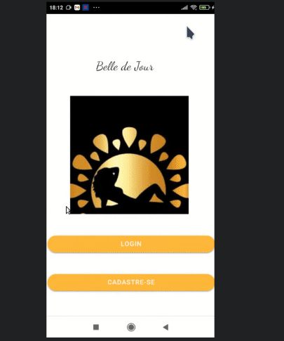

# Aplicativo de agendamento de clientes feito para a empresa Belle de Jour

## 📖 Descrição

Esse projeto se refere a um MVP de aplicativo de agendamento de clientes feito para a empresa Belle de Jour (uma empresa de brozeamento artificial de mulheres). As clientes costumam agendar um horário para ir à empresa se bronzear. Logo identifiquei que um possível aplicativo  tornaria esse processo mais fácil e prático para as clientes e para a empresária. 

## 🛠️ Funcionalidades

- Login de clientes
- Cadastro de clientes
- Cadastro de agendamento

## 📡 Tecnologias utilizadas

 

  

  

## ⏳ Inicialização

Esse projeto foi desenvolvido usando o framework de desenvolvimento mobile [Ionic](https://ionicframework.com/) em conjunto com o framework de desenvolvimento frontend [Angular](https://angular.io/). O backend foi o [MongoDB](https://www.mongodb.com/pt-br) e uma API Restful foi utilizada para comunicação entre o banco e o aplicativo. Caso queira conferir o código da API, ele está disponível [aqui](https://github.com/eduardovitor/API-app-BelledeJour).

## 🤵🤵‍♀️ Colaboradores

O único colaborador desse projeto fui eu (Eduardo Vítor).

 

## 🔎 Status do Projeto

 

## 📑 Referências

[Ionic](https://ionicframework.com/)

[Angular](https://angular.io/)

[MongoDB](https://www.mongodb.com/pt-br)

[API do projeto](https://github.com/eduardovitor/API-app-BelledeJour)
